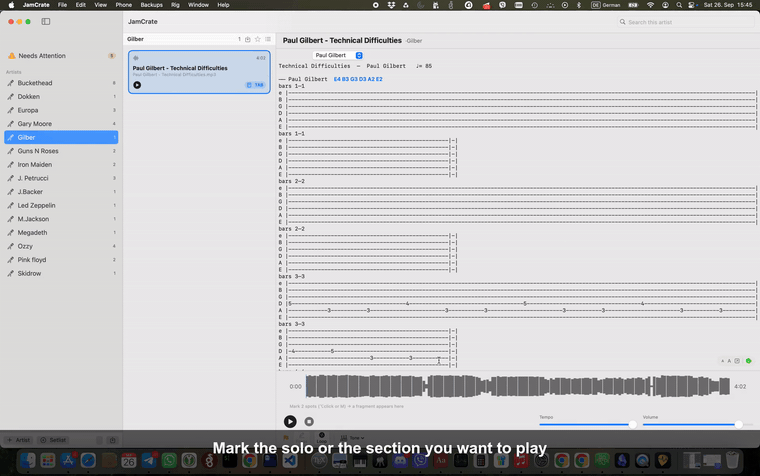

# JamCrate beta

Landing page, distribution and beta releases for the JamCrate macOS app.

**JamCrate** keeps your backing tracks, tabs and chord sheets in one place, on the Mac,
offline. Pick a song and play: every track sits at the same level, the solo you marked
loops in one click, the sheet is already open beside it, and your guitar processor
switches to the right preset on its own as the song goes by.

Free during beta. No account, no cloud, no subscription. Your files stay yours, in a
folder you can open in the Finder.

## What it does

- **Library** — drop files or a folder anywhere in the window, or press ⌘I. What is
  unambiguous imports straight away; what is not goes to a short review that names the
  real problem: a tab with no song, a possible duplicate, an unreadable name. Files are
  copied into a library you own, at `~/Music/JamCrate/<Band>/<Song>/`. Renaming moves
  the files with the name, deleting sends them to the Trash.
- **Player** — markers on the waveform, a solo looped in one click. *Frags* plays only
  the fragments you marked and skips the gaps, *Loop* repeats the track or the
  fragments. Tempo slows from 100% down to 50% with the pitch preserved — there is no
  speed-up and no separate pitch shift. Every track is level-matched on import, so
  changing songs does not move the volume knob.
- **Tabs** — PDF, plain text, ChordPro and Guitar Pro 3/4/5 open beside the transport.
  GP files are drawn as an aligned monospace grid, one track at a time. Auto-scroll
  follows playback, zoom runs 70–240%. This is a reader: GP playback is not in scope,
  and effects, bends, slides and lyrics are not drawn.
- **Setlists** — a numbered list per set, with Auto-next: the track ends, the next one
  starts, and after the last it stops honestly.
- **Sharing** — your markers and tone assignments live in `song.jamc.json` beside your
  own files and contain no audio, so passing that file to a friend is legal.
- **Backups** — ⇧⌘B writes a `.jamcrate.zip` of the library into `Backups/`; every
  backup is its own timestamped file, so the folder *is* the version history. Restore
  merges and never overwrites.
- **Languages** — English, Russian and German.

## Presets and MIDI

A preset is a `.jamrig` file — a folder with a `rig.json` in it, living in
`~/Music/JamCrate/Rigs/`. It is data, not code: which device names to match, the MIDI
channel, and a list of tones, each one a sequence of MIDI messages. Adding a device
means adding a file; rigs can be passed around. Open the Rig window with ⌥⌘R to see
profiles, connection status and a **Test** button on every tone.

- **M-VAVE Tank-G** — verified on the pedal itself: banks 1–9 × slots A–D over plain
  USB, with no vendor app running.
- **The rest of the M-VAVE family** — Tank-B, Tank-Mini, Tank-Pro, Blackbox, Hush, KE1,
  KPT Pro, MK20, MK300, SK17. These ship so their owners have something to try rather
  than nothing, and **none of them is verified**.
- **Line 6** (Helix / Stadium, HX Stomp and Stomp XL, HX Effects) and **Boss GT-1000 /
  GT-1000CORE** — the frames come from the makers' own MIDI documentation, and the names
  say *(documented)* on purpose: that is a claim about where the frames came from, not
  about your pedal.
- **Anything else** — describe it in a `.jamrig` and it works: program change, control
  change and SysEx are all supported.

Give a tone to a marker and it sounds from that point on; a default tone covers the rest
of the song. While playing, the message is fired as the playhead crosses the marker,
with a short lookahead and a quarter-second debounce.

**The honest part.** A wrong frame fails silently — CoreMIDI reports success and the
pedal ignores it. So press **Test** on a preset. If the pedal switches, that profile
works and the rest of it should too. If nothing happens, send the model name and which
preset you pressed to <beta@jamcrate.app>; that one line is usually enough to derive the
frame.

## Install

Free beta. macOS 14 Sonoma or later, Apple Silicon and Intel, signed and notarized — so
macOS opens it with an ordinary double-click.

- `brew install --cask vitas/jamcrate/jamcrate`, later `brew upgrade --cask jamcrate`
- Or the newest release's `JamCrate.dmg` (about 20 MB), same result.
- Install notes shipped inside the DMG: [DIST_README-notarized.md](DIST_README-notarized.md)
  for signed builds, [DIST_README.md](DIST_README.md) for the ad-hoc fallback.
- Nothing to install: <https://play.jamcrate.app> — the browser player, demo set included.

## Links

- Site: <https://jamcrate.app>
- Feedback: Telegram <https://t.me/jamcrate> (mostly Russian), GitHub Discussions
  <https://github.com/vitas/jamcrate-beta/discussions> (English), <beta@jamcrate.app>

This repository holds the public site source, the release assets and the cask; the app
itself is closed source.
